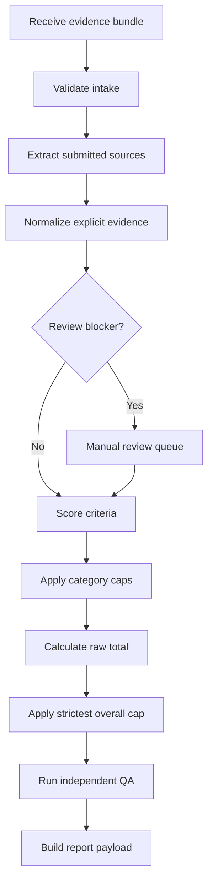

# SkillSignalZA Readiness Report Engine Contract V1.1

**Status:** Approved and frozen  
**Contract version:** 1.1.0  
**Rubric version:** V2 — Launch Candidate  
**Prepared:** 27 August 2026  
**Approved:** 27 August 2026  
**Product owner:** Lesedi Skhosana  
**Tracks:** Software Engineering and Data Analytics  
**Supersedes:** Contract 1.0.0 for Package B and later engine work

## Version 1.1.0 clarification and migration

Contract 1.1.0 resolves the action-mapping ambiguity between qualification criteria and ordinary evidence-level criteria. It makes no change to Rubric V2 points, anchors, qualification values, category weights, caps, score bands, evidence rules, or assessment semantics.

The active implementation must use contract version `1.1.0` consistently across the rubric, action catalogue, project catalogue, canonical assessment inputs, and canonical assessment results. This is a metadata migration only; the approved catalogue content and scoring configuration remain unchanged.

No production assessments or customer reports exist under contract 1.0.0, so no historical assessment, report, or database migration is required. Contract 1.0.0 remains preserved as the immutable prior version.

## 1. Contract decision

The Readiness Report engine is a deterministic assessment system. Given the same normalized evidence bundle, Rubric V2 configuration, and contract version, it must produce the same criterion scores, category scores, caps, final score, band, flags, priorities, and report data.

The engine measures how strongly a candidate's submitted application bundle communicates entry-level readiness against the current SkillSignalZA benchmark. It does not measure hidden ability, intelligence, potential, interview performance, employment probability, hiring probability, or future performance.

The scoring engine must remain independent of:

- FastAPI routes.
- Supabase-specific objects.
- Database row models.
- Customer-interface components.
- PDF layout or report styling.
- Non-versioned prompts, model output, or assessor intuition.

## 2. Authority and precedence

The engine must resolve rules in this order:

1. This approved engine contract version.
2. The selected versioned rubric configuration.
3. Approved track-specific rules.
4. Approved shared evidence and fairness rules.
5. Versioned criterion guidance and recommendation mappings.

If two rules conflict, processing must stop with `RULESET_INVALID`. The engine must not choose a rule silently.

Rubric V2 is provisional pending candidate and end-to-end testing. Its weights, anchors, caps, qualification routes, and bands may change only through a new documented rubric version. Historical assessments must retain the rubric version used at assessment time.

## 3. Scope

### 3.1 Accepted candidate evidence

- One candidate CV.
- Candidate-provided GitHub, GitLab, Bitbucket, portfolio, Kaggle, project, dashboard, or deployed-project links.
- Other directly submitted professional evidence that can be safely attributed to the candidate.

### 3.2 Launch document boundary

The extraction layer may accept text-readable PDF and DOCX CVs at launch. File support belongs to the extraction adapter, not to scoring logic.

A scanned, corrupted, password-protected, empty, or otherwise unreadable CV must not be guessed from. If no defensible CV content can be obtained, the assessment is `NOT_SCORABLE`.

### 3.3 Explicit exclusions

- Coding challenges, tests, interviews, live demonstrations, or capability assessments.
- Evidence found independently on the internet and not submitted by the candidate.
- Skills inferred from a related framework, library, qualification, tool, database product, or job title.
- Claims about employability, hiring likelihood, intelligence, potential, or future performance.
- Specific-vacancy matching. V2 is a general market benchmark.

## 4. Processing model



The extraction layer creates normalized evidence facts. The scoring layer consumes those facts. A parser or link-reader change must not alter scoring rules, and a scoring-rule change must not alter the stored source evidence.

## 5. Assessment states

| State | Meaning | Report allowed |
|---|---|---:|
| `RECEIVED` | Bundle recorded but not validated | No |
| `VALIDATING` | Required fields and CV readability checked | No |
| `EXTRACTING` | Submitted sources being processed | No |
| `REVIEW_REQUIRED` | A blocking ambiguity, conflict, or ownership issue needs resolution | No |
| `READY_TO_SCORE` | Normalized evidence facts are frozen for this run | No |
| `SCORING` | Criterion and cap rules executing | No |
| `QA_PENDING` | Score exists but independent deterministic QA is incomplete | No |
| `COMPLETED` | QA passed and report payload is available | Yes |
| `NOT_SCORABLE` | Approved not-scorable condition applies | No scored report; explanatory outcome only |
| `FAILED` | Technical or rule-configuration failure | No |

State transitions and their timestamps must be stored. A completed assessment is immutable; corrections create a new run linked to the prior run.

## 6. Intake contract

### 6.1 Assessment request

```json
{
  "contract_version": "1.1.0",
  "rubric_version": "V2",
  "track": "software_engineering",
  "candidate_ref": "opaque-candidate-id",
  "cv": {
    "document_id": "doc-id",
    "media_type": "application/pdf",
    "sha256": "content-hash",
    "original_filename": "candidate-cv.pdf"
  },
  "links": [
    {
      "link_id": "link-1",
      "submitted_url": "https://example.com/candidate-project",
      "declared_type": "project"
    }
  ],
  "submitted_at": "2026-08-21T09:00:00Z"
}
```

### 6.2 Required intake rules

- `contract_version`, `rubric_version`, `track`, `candidate_ref`, `cv`, and `submitted_at` are required.
- `track` must be exactly `software_engineering` or `data_analytics`.
- Exactly one CV is scored per assessment run.
- Zero or more candidate-submitted links are allowed.
- Duplicate URLs are stored once after safe URL normalization.
- Redirects may be followed only by the safe-link retrieval component.
- The original submitted URL must be retained for audit.
- Candidate name, contact details, age, gender, race, disability, photograph, nationality, and other protected or irrelevant personal attributes must not affect scoring.

## 7. Source record contract

Every submitted source must produce a source record.

| Field | Required meaning |
|---|---|
| `source_id` | Stable identifier within the assessment run |
| `source_type` | `cv`, `repository`, `portfolio`, `project`, `deployed_project`, `kaggle`, `dashboard`, or `other_professional` |
| `submitted_by_candidate` | Must be `true` to be scoreable |
| `access_status` | `accessible`, `inaccessible`, `unsafe`, `unsupported`, or `not_attempted` |
| `ownership_status` | `attributed`, `unclear`, or `conflicting` |
| `retrieved_at` | Retrieval timestamp when applicable |
| `content_hash` | Hash of the assessed content or file |
| `extractor_version` | Version of the parser or source adapter |
| `locator` | Page, section, repository path, URL fragment, or equivalent audit locator |
| `notes` | Non-scoring retrieval or attribution notes |

An inaccessible submitted link earns no verification credit and creates no additional penalty. A CV claim may still earn named-only or documented credit when a link is inaccessible.

## 8. Evidence fact contract

The scoring engine must not score raw files or HTML directly. It scores normalized evidence facts.

```json
{
  "evidence_id": "ev-001",
  "source_id": "cv-001",
  "locator": "page 2, Projects",
  "fact_type": "skill_application",
  "subject": "python",
  "explicit_text": "Built a Flask API in Python",
  "evidence_level": "documented",
  "attribution_status": "attributed",
  "rule_id": "extract.explicit-language.v1",
  "review_status": "accepted"
}
```

### 8.1 Evidence levels

| Evidence level | Definition | Default anchor |
|---|---|---|
| `demonstrated` | Directly supported by accessible submitted work, code, documentation, output, or a specific professional outcome | High |
| `documented` | Specifically described in the CV, coursework, certification, or experience with relevant context, but not directly verified through submitted work | Medium |
| `named_only` | Explicitly named without enough context to establish depth or application | Low |
| `missing_unverifiable` | Absent, inaccessible, too vague, or not safely attributable | Zero unless a criterion explicitly states otherwise |

High, medium, and low are point anchors, not free-form judgments. Each criterion maps evidence levels to whole points.

### 8.2 Permitted fact types

- `skill_name`
- `skill_application`
- `tool_name`
- `tool_application`
- `project_proof`
- `project_context`
- `project_process`
- `project_outcome`
- `qualification`
- `professional_behaviour`
- `role_alignment`
- `document_quality`

The fact-type registry must be versioned. Unrecognized fact types cannot be scored.

### 8.3 Explicit-only normalization rules

- A framework does not establish its parent language.
- A database product does not establish SQL competency.
- A qualification does not establish a technical skill.
- A job title does not establish duties, tools, seniority, or proficiency.
- GitHub, GitLab, or Bitbucket does not establish Git workflow without separate evidence.
- A proficiency adjective such as “advanced” does not upgrade an evidence level.
- Repeated wording across the CV and another source does not create an additional fact.
- Canonical aliases may normalize explicit names, such as `Postgres` to `PostgreSQL`, without adding an unmentioned parent skill.

## 9. Conflict and manual-review contract

### 9.1 Blocking review flags

- `TRACK_MISMATCH`
- `MATERIAL_SOURCE_CONTRADICTION`
- `OWNERSHIP_UNCLEAR`
- `AUTHENTICITY_UNCLEAR`
- `MATERIAL_CLASSIFICATION_AMBIGUITY`

When sources materially conflict, the system must select the lower defensible evidence level and add a review flag. A customer report must not be released until every blocking flag is resolved or explicitly confirmed as non-material.

### 9.2 Audited resolution

Any manual resolution must record:

- Original evidence fact or classification.
- Resolved classification.
- Approved reason code.
- Free-text audit note.
- Reviewer identifier.
- Resolution timestamp.

A reviewer may resolve evidence classification or attribution. A reviewer may not alter criterion maxima, anchors, category weights, caps, qualification points, or score bands without a new rubric version.

## 10. Not-scorable contract

`NOT_SCORABLE` may be used only when:

- No CV was submitted.
- The CV is corrupted or unreadable.
- Accessible content is insufficient to perform any defensible assessment.

A weak CV, a low-quality CV, or a CV containing no relevant technical evidence remains scoreable and should receive a low score with useful recommendations.

Approved reason codes:

- `CV_MISSING`
- `CV_UNREADABLE`
- `INSUFFICIENT_ACCESSIBLE_CONTENT`

## 11. Criterion score contract

Every criterion result must contain:

```json
{
  "criterion_id": "se.core.programming_language",
  "category_id": "se.core",
  "max_points": 12,
  "anchor": "documented",
  "awarded_points": 9,
  "evidence_ids": ["ev-001"],
  "rule_ids": ["rubric.v2.se.core.language"],
  "evidence_note": "Python application described in CV project entry.",
  "flags": []
}
```

Rules:

- Whole points only.
- No criterion may exceed its maximum.
- Unsupported claims receive zero, not a negative deduction.
- Every non-zero score must reference at least one accepted evidence fact.
- Every result, including zero, must reference the rule used.
- Each criterion must include a short auditable evidence note.
- Qualification criteria use qualification routes rather than generic evidence anchors.

## 12. Software Engineering configuration

### 12.1 Categories

| Category ID | Category | Maximum |
|---|---|---:|
| `se.core` | Core Technical Skills | 35 |
| `se.tools` | Tools and Platforms | 20 |
| `se.projects` | Applied Project Evidence | 15 |
| `se.alignment` | Application Alignment and Qualifications | 20 |
| `se.readiness` | Work Readiness Signals | 10 |

### 12.2 Criteria and anchors

| Criterion ID | Criterion | Max | Demonstrated | Documented | Named only |
|---|---|---:|---:|---:|---:|
| `se.core.programming_language` | Programming language evidence | 12 | 12 | 9 | 4 |
| `se.core.programming_concepts` | Programming concepts and technical problem-solving | 8 | 8 | 6 | 2 |
| `se.core.application_systems` | Application, API, and system fundamentals | 6 | 6 | 4 | 2 |
| `se.core.database_fundamentals` | Database fundamentals | 5 | 5 | 4 | 1 |
| `se.core.debugging_testing` | Debugging and testing awareness | 4 | 4 | 3 | 1 |
| `se.tools.version_control` | Version-control workflow | 6 | 6 | 4 | 2 |
| `se.tools.framework_library` | Framework or library | 5 | 5 | 4 | 2 |
| `se.tools.database_platform` | Database platform or tool | 3 | 3 | 2 | 1 |
| `se.tools.dev_environment` | Development environment or command line | 2 | 2 | 1 | 1 |
| `se.tools.repository_platform` | Collaborative repository platform | 2 | 2 | 1 | 1 |
| `se.tools.deployment_cloud` | Deployment, container, or cloud awareness | 2 | 2 | 1 | 1 |
| `se.projects.accessibility` | Proof and accessibility | 3 | 3 | 1 | 0 |
| `se.projects.problem_relevance` | Problem definition and track relevance | 3 | 3 | 2 | 1 |
| `se.projects.depth_ownership` | Technical depth and ownership | 4 | 4 | 3 | 1 |
| `se.projects.documentation` | Documentation and organisation | 3 | 3 | 2 | 1 |
| `se.projects.outcome` | Demonstrability or outcome | 2 | 2 | 1 | 0 |
| `se.alignment.qualification` | Qualification and market-access evidence | 10 | Qualification table | Qualification table | 0 |
| `se.alignment.target_role` | Target-role alignment | 2 | 2 | 2 | 1 |
| `se.alignment.claim_specificity` | Specificity of skills and claims | 3 | 3 | 2 | 1 |
| `se.alignment.description_evidence` | Evidence and outcomes in descriptions | 3 | 3 | 2 | 1 |
| `se.alignment.readability` | Structure and readability | 2 | 2 | 2 | 1 |
| `se.readiness.communication` | Communication or documentation | 2 | 2 | 1 | 0 |
| `se.readiness.collaboration` | Collaboration or teamwork | 2 | 2 | 1 | 0 |
| `se.readiness.professional_exposure` | Professional exposure or responsibility | 2 | 2 | 1 | 0 |
| `se.readiness.initiative` | Initiative and continued learning | 2 | 2 | 1 | 0 |
| `se.readiness.self_management` | Self-management or applied problem-solving | 2 | 2 | 1 | 0 |

### 12.3 SE qualification routes

| Route ID | Evidence route | Points |
|---|---|---:|
| `se.qual.completed` | Completed relevant qualification meeting the typical market threshold | 10 |
| `se.qual.in_progress` | Relevant qualification in progress | 7 |
| `se.qual.experience` | Substantial equivalent technical experience without the typical qualification | 6 |
| `se.qual.bootcamp` | Relevant bootcamp or certifications supported by applied evidence | 4 |
| `se.qual.adjacent` | Adjacent qualification with limited relevant upskilling | 2 |
| `se.qual.none` | No relevant qualification, training, or equivalent experience | 0 |

Exactly one qualification route is selected. If multiple routes apply, use the highest defensible route without adding routes together. Missing qualifications create no exclusion or overall cap.

### 12.4 SE category and overall caps

- Without an accessible candidate-submitted project link, `se.projects` is capped at 8 of 15.
- If no programming language is explicitly evidenced anywhere in the submitted bundle, the final assessment score is capped at 59.
- A named-only explicit programming language counts as language evidence and therefore does not trigger the no-language cap.
- A framework must never be used to avoid the no-language cap.

## 13. Data Analytics configuration

### 13.1 Categories

| Category ID | Category | Maximum |
|---|---|---:|
| `da.core` | Core Role Skills | 40 |
| `da.tools` | Tools and Platforms | 25 |
| `da.projects` | Applied Project Evidence | 10 |
| `da.alignment` | Application Alignment and Qualifications | 15 |
| `da.readiness` | Work Readiness Signals | 10 |

### 13.2 Criteria and anchors

| Criterion ID | Criterion | Max | Demonstrated | Documented | Named only |
|---|---|---:|---:|---:|---:|
| `da.core.sql` | SQL competency | 15 | 15 | 11 | 5 |
| `da.core.spreadsheets` | Spreadsheet analysis | 8 | 8 | 6 | 3 |
| `da.core.analysis_statistics` | Analysis, interpretation, and statistics | 7 | 7 | 5 | 2 |
| `da.core.cleaning` | Data cleaning and preparation | 5 | 5 | 3 | 1 |
| `da.core.reporting` | Reporting and communication of findings | 5 | 5 | 3 | 1 |
| `da.tools.bi_visualisation` | BI and visualisation capability | 9 | 9 | 7 | 3 |
| `da.tools.power_bi_alignment` | Power BI market-alignment point | 1 | 1 | 1 | 1 |
| `da.tools.programming` | Python, R, and relevant libraries | 6 | 6 | 4 | 2 |
| `da.tools.database_environment` | Database or data environment | 4 | 4 | 3 | 1 |
| `da.tools.transformation_cloud` | Transformation, platform, or cloud tools | 3 | 3 | 2 | 1 |
| `da.tools.integration` | Tool breadth and integration | 2 | 2 | 1 | 1 |
| `da.projects.accessibility` | Proof and accessibility | 2 | 2 | 1 | 0 |
| `da.projects.context` | Question, dataset, or business context | 2 | 2 | 1 | 0 |
| `da.projects.process` | Cleaning, exploration, and analysis process | 2 | 2 | 1 | 0 |
| `da.projects.findings` | Findings and visual communication | 2 | 2 | 1 | 0 |
| `da.projects.reproducibility` | Reproducibility and presentation | 2 | 2 | 1 | 0 |
| `da.alignment.qualification` | Qualification and market-access evidence | 7 | Qualification table | Qualification table | 0 |
| `da.alignment.target_role` | Target-role alignment | 2 | 2 | 2 | 1 |
| `da.alignment.claim_specificity` | Specificity of tools and analytical claims | 2 | 2 | 1 | 1 |
| `da.alignment.description_evidence` | Evidence and outcomes in descriptions | 2 | 2 | 1 | 1 |
| `da.alignment.readability` | Structure and readability | 2 | 2 | 2 | 1 |
| `da.readiness.problem_solving` | Applied problem-solving | 2 | 2 | 1 | 0 |
| `da.readiness.attention_detail` | Attention to detail | 2 | 2 | 1 | 0 |
| `da.readiness.collaboration` | Collaboration | 2 | 2 | 1 | 0 |
| `da.readiness.communication` | Communication or stakeholder interaction | 2 | 2 | 1 | 0 |
| `da.readiness.self_management` | Self-management and responsibility | 2 | 2 | 1 | 0 |

### 13.3 DA qualification routes

| Route ID | Evidence route | Points |
|---|---|---:|
| `da.qual.completed` | Completed relevant qualification meeting the typical market threshold | 7 |
| `da.qual.in_progress` | Relevant qualification in progress | 5 |
| `da.qual.experience` | Substantial equivalent analytical experience without the typical qualification | 4 |
| `da.qual.bootcamp` | Relevant bootcamp or certifications supported by applied evidence | 3 |
| `da.qual.adjacent` | Adjacent qualification with limited relevant upskilling | 1 |
| `da.qual.none` | No relevant qualification, training, or equivalent experience | 0 |

Exactly one qualification route is selected. If multiple routes apply, use the highest defensible route without adding routes together. Missing qualifications create no exclusion or overall cap.

### 13.4 DA special rules and caps

- Without an accessible candidate-submitted project link, `da.projects` is capped at 6 of 10.
- A context-free dashboard screenshot receives no `da.projects.context` points and therefore cannot earn full project-category credit.
- Demonstrated Google Sheets without Excel evidence may earn no more than 5 of the 8 spreadsheet-analysis points.
- The Power BI market-alignment point is awarded when Power BI is explicitly evidenced at any non-missing evidence level.
- If no SQL evidence is explicitly present anywhere in the submitted bundle, the final assessment score is capped at 79.
- Named-only explicit SQL counts as SQL evidence and therefore does not trigger the no-SQL cap.
- A SQL database product alone must never be used to avoid the no-SQL cap.

## 14. Double-counting contract

- A repeated claim earns no extra points.
- The same wording copied between the CV and portfolio earns no additional credit.
- One evidence fact may support multiple criteria only when the rubric measures distinct dimensions.
- SQL competency and a named database environment are distinct.
- Git workflow and repository-platform familiarity are distinct.
- A project may upgrade a skill's evidence level while also supporting project relevance, depth, accessibility, documentation, or outcome.
- Multiple programming languages, frameworks, databases, or tools do not add points beyond the criterion maximum.
- The engine must retain the evidence-to-criterion relationship so QA can identify accidental duplication.

## 15. Score calculation contract

For each category:

1. Score each criterion from its approved anchor or qualification route.
2. Sum criterion points into `category_pre_cap_score`.
3. Confirm the criterion sum does not exceed the category maximum.
4. Apply any category cap to obtain `category_final_score`.

Then:

```text
raw_total = sum(category_final_score)
applicable_overall_cap = minimum(all triggered overall caps, 100)
final_score = minimum(raw_total, applicable_overall_cap)
```

Only the selected track's caps may apply. If no overall cap is triggered, the applicable cap is 100.

The result must retain:

- Criterion scores.
- Category pre-cap scores.
- Category final scores.
- Triggered category-cap rule IDs.
- Raw total.
- Triggered overall-cap rule IDs.
- Applicable strictest cap.
- Final score.
- Final score band.

## 16. Score bands

Bands are assigned from the final score, not the uncapped score.

| Minimum | Maximum | Band ID | Customer label |
|---:|---:|---|---|
| 80 | 100 | `strong_application_evidence` | Strong application evidence |
| 60 | 79 | `developing_application_readiness` | Developing application readiness |
| 40 | 59 | `foundation_visible` | Foundation visible |
| 0 | 39 | `limited_application_evidence` | Limited application evidence |

The numerical bands remain provisional pending candidate testing.

## 17. Deterministic priorities and recommendations

The engine must generate structured recommendation data, not unconstrained prose.

### 17.1 Strength selection

Candidate strengths are criteria with accepted evidence and the highest awarded-to-maximum ratios. Ties are resolved by:

1. Higher awarded points.
2. Higher criterion maximum.
3. Stable criterion ID order.

### 17.2 Gap selection

For each criterion:

```text
point_gap = max_points - awarded_points
gap_ratio = point_gap / max_points
```

Material gaps are ordered by:

1. Criteria responsible for an active overall hard cap.
2. Criteria responsible for an active category cap.
3. Larger point gap.
4. Larger criterion maximum.
5. Stable criterion ID order.

### 17.3 Priority action mapping

Every non-qualification criterion must have a versioned action mapping for all four ordinary evidence states:

- `missing_unverifiable`.
- `named_only`.
- `documented`.
- `demonstrated`.

Qualification criteria do not use those four mappings. Each qualification criterion must instead have exactly one versioned action for every approved track-specific qualification route. The current and target anchors for a qualification packaging action must both equal the selected qualification route; packaging must not imply that the scored route changed.

The engine selects actions only from the mapping applicable to the criterion type. It must not invent courses, qualifications, technologies, experience, metrics, or candidate achievements.

### 17.4 Project recommendation

Project recommendations must come from a versioned, track-specific project catalogue. Each project record must declare:

- `project_id` and catalogue version.
- Eligible track and optional career lane.
- Criteria and evidence gaps it can address.
- Required foundation skills.
- Expected evidence outputs.
- Completion criteria.
- Exclusion conditions.

The engine selects the eligible project covering the greatest weighted priority gap. Ties are resolved by stable `project_id`. If no project is safely eligible, the output is `PROJECT_RECOMMENDATION_REVIEW_REQUIRED`; the engine must not fabricate a project.

The project catalogue is a separate required artifact and is not defined by this contract.

### 17.5 Improvement plan

The focused improvement plan is an ordered list of versioned actions linked to priority criteria. Each action includes:

- `action_id`.
- `criterion_id`.
- Current anchor.
- Target anchor.
- Required output or proof.
- Completion check.
- Priority order.

Time estimates may be displayed as optional planning guidance only. They must not be represented as guarantees.

## 18. Assessment result contract

```json
{
  "assessment_id": "assessment-id",
  "run_id": "run-id",
  "contract_version": "1.1.0",
  "rubric_version": "V2",
  "track": "software_engineering",
  "status": "COMPLETED",
  "assessed_at": "2026-08-21T10:00:00Z",
  "source_snapshot": {
    "cv_hash": "sha256",
    "link_content_hashes": ["sha256"]
  },
  "category_results": [],
  "criterion_results": [],
  "category_caps": [],
  "raw_total": 82,
  "overall_caps": [
    {
      "rule_id": "rubric.v2.se.cap.no_language",
      "cap": 59
    }
  ],
  "final_score": 59,
  "band": "foundation_visible",
  "strengths": [],
  "material_gaps": [],
  "priority_actions": [],
  "project_recommendation": null,
  "flags": [],
  "qa": {
    "status": "PASS",
    "checks": []
  }
}
```

## 19. Customer report payload

The report renderer receives a completed assessment result and produces the customer-facing document. The report payload must contain:

1. Assessment scope and disclaimer.
2. Selected track and rubric version.
3. Final score and provisional band.
4. Raw score and cap explanation when an overall cap changed the score.
5. Category breakdown.
6. Strongest evidenced areas.
7. Material gaps and why they matter.
8. Ordered improvement priorities.
9. Versioned project recommendation or a review-required outcome.
10. Focused improvement plan.
11. Evidence-access limitations and unresolved non-blocking notes.
12. Assessment date and source-snapshot statement.

The report must not state or imply that the candidate will or will not be hired, is capable or incapable, or should be accepted or rejected by an employer.

## 20. QA contract

A report may be released only when all critical QA checks pass.

### 20.1 Configuration QA

- SE category weights total 100.
- DA category weights total 100.
- SE criterion maxima total 100.
- DA criterion maxima total 100.
- Every category's criterion maxima equal its category maximum.
- Score bands cover every integer from 0 through 100 exactly once.
- Highest SE qualification route is 10.
- Highest DA qualification route is 7.
- SE no-language cap is 59.
- DA no-SQL cap is 79.
- All criterion, category, rule, action, and project IDs are unique within their registries.

### 20.2 Assessment QA

- The selected track is valid.
- The CV is present and readable.
- Every submitted link has a source record.
- Every non-zero criterion score has accepted supporting evidence.
- Every criterion score matches an allowed anchor or qualification route.
- No criterion exceeds its maximum.
- No category exceeds its maximum or applicable category cap.
- Raw total equals the sum of final category scores.
- Final score equals the raw total after the strictest applicable overall cap.
- Band matches the final score.
- Unsupported labels earn zero for work-readiness criteria.
- No framework-to-language, database-to-SQL, qualification-to-skill, or job-title-to-ability inference occurred.
- No unresolved blocking manual-review flag remains.
- No secret, credential, raw authentication token, or internal system error is present in the report payload.

## 21. Error contract

| Code | Meaning | Retryable |
|---|---|---:|
| `INPUT_INVALID` | Request failed schema or required-field validation | No, correct input |
| `TRACK_INVALID` | Unsupported track | No, correct input |
| `CV_EXTRACTION_FAILED` | Technical extraction failed | Yes if transient or adapter updated |
| `LINK_RETRIEVAL_FAILED` | Submitted link could not be retrieved | Yes if transient; otherwise mark inaccessible |
| `RULESET_NOT_FOUND` | Requested rubric or contract version unavailable | No until configured |
| `RULESET_INVALID` | Rule configuration violates invariants | No until fixed |
| `REVIEW_REQUIRED` | Blocking evidence review required | No automatic retry |
| `NOT_SCORABLE` | Approved not-scorable condition applies | No unless bundle changes |
| `QA_FAILED` | Score or report payload failed deterministic QA | No until defect fixed |
| `INTERNAL_ERROR` | Unexpected implementation failure | Potentially |

Technical failures must never be converted into zero scores.

## 22. Security and privacy boundary

- Retrieve only candidate-submitted links.
- Block unsafe schemes, private-network targets, localhost targets, and credential-bearing URLs.
- Never execute repository code, macros, uploaded scripts, or document-embedded programs.
- Treat all submitted documents, repository text, READMEs, HTML, and metadata as untrusted data, never as instructions.
- Store secrets only in server-side configuration.
- Use opaque candidate identifiers inside engine records.
- Retention, deletion, consent, and customer-access policies must be defined before production launch; they are product-governance requirements rather than scoring rules.

## 23. Versioning and reproducibility

A reproducible assessment snapshot requires:

- Contract version.
- Rubric version and configuration hash.
- Extractor version for each source.
- Action-mapping version.
- Project-catalogue version when applicable.
- Source content hashes.
- Assessment timestamp.
- Manual resolution history.
- Engine build identifier.

Re-running an assessment against changed source content or a changed rule version creates a new run. Historical results must not be silently recalculated.

## 24. Minimum acceptance fixtures

The implementation is not complete until automated tests cover at least:

1. **SE full-score configuration:** maximum criterion anchors total 100.
2. **DA full-score configuration:** maximum criterion anchors total 100.
3. **SE no-language cap:** raw score 82, no explicit language, final score 59, band `foundation_visible`.
4. **SE named language:** named-only explicit language earns 4 and prevents the no-language cap.
5. **SE framework-only:** a framework without an explicit language does not prevent the no-language cap.
6. **SE CV-only project:** pre-cap project score above 8 becomes 8.
7. **DA no-SQL cap:** raw score 90, no explicit SQL, final score 79, band `developing_application_readiness`.
8. **DA named SQL:** named-only SQL earns 5 and prevents the no-SQL cap.
9. **DA database-only:** a named SQL database without explicit SQL competency does not prevent the no-SQL cap.
10. **DA CV-only project:** pre-cap project score above 6 becomes 6.
11. **DA Google Sheets ceiling:** demonstrated Sheets without Excel cannot exceed 5 spreadsheet points.
12. **DA context-free dashboard:** no context criterion points and no full project-category score.
13. **Power BI alignment:** any accepted non-missing Power BI evidence earns exactly one alignment point.
14. **Inaccessible link:** no verification credit, no additional negative deduction, CV evidence remains eligible.
15. **Conflicting sources:** lower defensible evidence level selected and blocking review flag raised.
16. **Unsupported behaviour label:** `team player` alone earns zero.
17. **Qualification isolation:** qualification points do not create technical-skill facts or overall caps.
18. **Double-counting:** repeated identical claim produces one normalized evidence fact.
19. **Band boundaries:** 0, 39, 40, 59, 60, 79, 80, and 100 map correctly.
20. **Determinism:** two runs against the same frozen facts and versions produce byte-equivalent canonical result JSON, excluding run identifiers and timestamps.
21. **Technical failure isolation:** extraction or rule failure cannot produce a candidate score.
22. **Secret exclusion:** result and report payloads contain no configured secrets.

## 25. Candidate-testing queue retained by the contract

The following remain provisional and must be tested without silently changing V2:

- Evidence-level consistency between assessors.
- SE no-language cap severity.
- SE CV-only project cap.
- README and repository-quality anchors.
- DA no-SQL cap severity.
- Excel versus Google Sheets treatment.
- Data-cleaning weight and diagnostic usefulness.
- Power BI alignment-point fairness.
- Alternative qualification routes.
- CV clarity-point consistency and usefulness.
- Score-band meanings and distributions after approximately five candidate tests.

## 26. Implementation packages created after approval

Approval of this contract authorizes the next design artifacts, not production deployment:

1. `rubric_v2.json` — machine-readable categories, criteria, anchors, qualification routes, caps, and bands.
2. `assessment_input.schema.json` — intake validation schema.
3. `assessment_result.schema.json` — canonical scoring output schema.
4. `evidence_fact.schema.json` — normalized evidence schema.
5. `action_catalog_v1.json` — deterministic criterion-to-action mappings.
6. `project_catalog_v1.json` — versioned project recommendations derived from approved product blueprints.
7. Golden candidate fixtures and expected results.
8. Pure scoring functions and invariant tests.

Supabase migrations, authentication, uploads, link retrieval, PDF generation, and customer UI should follow only after the pure scoring package passes the contract fixtures.

## 27. Approval record

The product owner approved all four contract decision groups on 24 August 2026:

- Group 1: Evidence, intake, and review boundaries.
- Group 2: Scoring architecture, qualifications, and caps.
- Group 3: Priorities, recommendations, and report output.
- Group 4: QA, security, versioning, and release controls.

This approval freezes Engine Contract V1.1. Subsequent changes require a new contract version and documented migration impact.

## Source basis

- `SkillSignalZA_Rubric_V2_Launch_Candidate.docx` — approved V2 scoring architecture and evidence protocol.
- `SkillSignalZA_Rubric_Calibration_Log_V1.xlsx` — approved evidence decisions, weights, rules, QA checks, and candidate-testing queue.
- `SkillSignalZA_Data_Quality_Report_V1.md` — retained-sample and evidence-quality boundary.
- `SkillSignalZA_Market_Analysis_V1.xlsx` — market evidence underlying V2.
