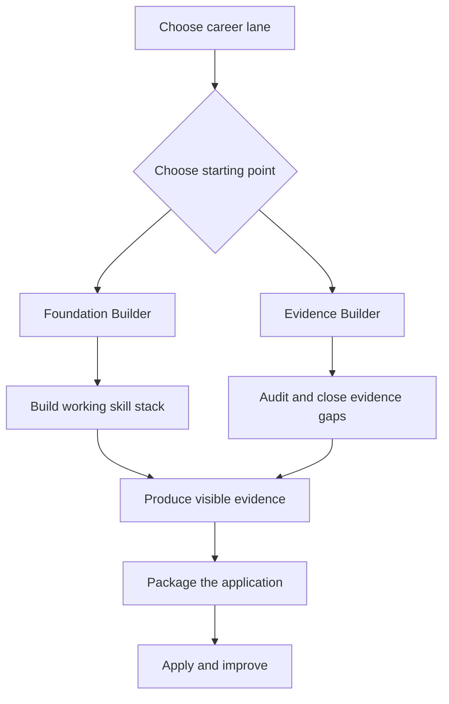

# SkillSignalZA — Project Progress

> Living project tracker and source of truth. Update this file whenever a milestone is completed, a decision changes, or the immediate next action changes.

**Last updated:** 20 August 2026  
**Current stage:** Phase 11 — Readiness Report engine and customer report  
**Paid MVP launch progress:** 80%  
**Repository:** https://github.com/LSkhosana/SkillsSignalZA

## 1. Current position

SkillSignalZA has completed its core research and assessment-design foundation. The product concept, initial rubric, collection methodology, local job-post collector, market-data collection, dataset cleaning, market analysis, evidence-based rubric revision, and candidate evidence rules are complete.

The **Software Engineering Career Map Pack V1.0** and **Data Analytics Career Map Pack V1.0** are complete and customer-ready. Each product is a 39-page guide and action planner grounded in its retained track sample and the approved Rubric V2 decisions. Both packs cover route selection, market priorities, shared foundations, career lanes, milestone paths, four project blueprints, application packaging, a 30/60/90-day route, and printable planning worksheets. Content, evidence, usability, and page-level visual QA are complete.

Phase 10 is complete. The current focus is Phase 11: the deterministic Readiness Report engine and reusable customer report.

### Research sample

The raw collection contained 58 rows. After removing one exact duplicate, 57 unique posts remained and were fully reconciled:

| Final treatment | Software Engineering | Data Analytics | Total |
|---|---:|---:|---:|
| Main analysis sample | 22 | 16 | 38 |
| Adjacent evidence | 5 | 10 | 15 |
| Role-fit exclusions | 2 | 2 | 4 |
| **Total unique posts** | **29** | **28** | **57** |

The locked main-sample denominator is **38 posts: 22 Software Engineering and 16 Data Analytics**. This is sufficient for concept validation, not a census of the South African entry-level technology market.

## 2. Product goal and offer structure

SkillSignalZA helps entry-level South African technology candidates understand market expectations, build visible evidence, and evaluate how strongly their application bundle communicates readiness.

Initial tracks:

- Software Engineering
- Data Analytics

Approved offer structure:

| Product | Price | Purpose |
|---|---:|---|
| Career Map Pack | R69 | Self-guided track navigation, milestone roadmap, project options and action planning |
| Readiness Report | R159 | Deterministic assessment of a candidate's CV and submitted evidence |
| Full Bundle | R199 | Career Map Pack plus Readiness Report |

The Career Map Pack is the immediate build priority. It must be useful without a CV upload, individual scoring, manual assessment, a customer dashboard, or a Readiness Report engine.

## 3. Completed work

### Product and research foundation

- [x] Define the SkillSignalZA product concept and initial offer.
- [x] Select Software Engineering and Data Analytics as the two launch tracks.
- [x] Create Readiness Rubric V1 for both tracks.
- [x] Create the 21-field job-post collection template.
- [x] Define the inclusion, exclusion and explicit-evidence rules.

### Job-post collector

- [x] Build the local collection utility in the repository's `Scraper` folder.
- [x] Support Software Engineering and Data Analytics worksheet selection.
- [x] Accept job-post URLs and pasted-text fallback.
- [x] Extract structured fields using local rules.
- [x] Keep extracted fields editable before record creation.
- [x] Apply explicit-only detection for languages, frameworks, Git/GitHub and SQL.
- [x] Export updated `.xlsx` workbooks while preserving the master template.
- [x] Add automatic IDs, duplicate checks, backups and validation warnings.
- [x] Test the extraction-to-export workflow.

### Market-data collection and cleaning

- [x] Collect 30 Software Engineering and 27 Data Analytics posts.
- [x] Close collection at 57 unique usable posts after duplicate removal.
- [x] Review all 25 borderline track-fit roles.
- [x] Lock the 38-post main sample.
- [x] Preserve 15 adjacent roles separately.
- [x] Document four role-fit exclusions.
- [x] Complete terminology normalisation and stale-note cleanup.
- [x] Complete all 26 main-sample evidence-verification checks.
- [x] Produce the cleaned analysis-ready workbook.
- [x] Produce the data-quality report, change log and exclusion archive.

### Market analysis

- [x] Calculate track-level skill and tool frequencies.
- [x] Analyse qualifications, experience, geography and work arrangements.
- [x] Analyse repeated skill combinations and behavioural themes.
- [x] Compare Software Engineering and Data Analytics patterns.
- [x] Identify evidence supporting, challenging or unable to validate Rubric V1 assumptions.
- [x] Document the small purposive-sample limitation and the DA-010 geography conflict.

### Rubric V2 and assessment boundary

- [x] Recalibrate category weights using the retained market evidence.
- [x] Approve Software Engineering criteria and rules.
- [x] Approve Data Analytics criteria and rules.
- [x] Approve shared evidence and fairness rules.
- [x] Define demonstrated, documented, named-only and missing/unverifiable evidence levels.
- [x] Approve the Software Engineering no-language final-score cap of 59.
- [x] Approve the Data Analytics no-SQL final-score cap of 79.
- [x] Define qualification scoring as market-access evidence rather than technical ability.
- [x] Freeze `SkillSignalZA Rubric V2 — Launch Candidate` pending candidate testing.
- [x] Define the candidate application evidence bundle as the CV plus candidate-provided professional links.
- [x] Exclude coding tests, interviews, capability tests and independently discovered internet evidence from the launch assessment scope.
- [x] Define evidence review, manual-review flags, double-counting prevention and assessor QA checks.

## 4. Completed Phase 10 — Career Map Pack development

**Objective:** Develop the standalone Career Map Pack as a useful, low-cost, self-guided product before building the wider platform or Readiness Report engine.

### Approved product format

Each track-specific purchase is delivered as one customer-facing PDF containing:

1. **Career Map Guide** — the main market-informed navigation and milestone guide.
2. **Career Action Planner** — printable worksheets integrated into the guide.

There will be one Software Engineering pack and one Data Analytics pack. Beginner and evidence-building candidates will not be separated into different products.

### Approved customer outcome

The pack must help the buyer answer:

1. Which career lane should I target?
2. Which roles and job titles belong to that lane?
3. Which skills should I prioritise and which can wait?
4. What visible evidence should I build?
5. What milestones should I complete before and during applications?

### Approved progression structure

1. **Choose Your Career Lane** — select a realistic role direction and understand its responsibilities, titles and priority skill stack.
2. **Choose Your Starting Point** — use the Explain → Apply → Demonstrate check to select the correct route.
3. **Foundation Builder: Build a Working Skill Stack** — develop the understanding and practical ability required for the selected lane.
4. **Evidence Builder: Audit and Close Evidence Gaps** — review existing knowledge and strengthen only missing or weak evidence.
5. **Produce Visible Evidence** — complete and publish relevant work showing understanding, application and personal contribution.
6. **Package the Application** — translate evidence into clear CV content, project descriptions and accessible links.
7. **Apply and Improve** — repeat the application, gap-review and evidence-improvement cycle.

Approved flow:

### Approved milestone model

Progress is based primarily on milestones and understanding, not elapsed time. Each milestone will specify:

- Objective.
- What the candidate should understand and explain.
- What the candidate should be able to apply.
- What evidence or output should exist.
- Completion criteria.
- Optional suggested pacing.

The pack will include flexible **60-day and 90-day pacing examples**, but these are planning aids rather than promises or mandatory deadlines.

### Approved starting points

| Starting point | Intended user | Typical pacing guide |
|---|---|---|
| Foundation Builder | Cannot yet confidently explain or apply the selected lane's foundations | Closer to 90 days |
| Evidence Builder | Can explain and apply relevant skills but lacks credible visible evidence | Closer to 60 days |

Candidates who can already explain, apply and demonstrate their skills may enter at the application-packaging milestone.

### Product boundaries

The Career Map Pack will not include:

- An individual readiness score or band.
- Personal CV assessment or rewriting.
- Candidate-specific gap diagnosis.
- Manual inspection of GitHub or portfolio links.
- A personalised project recommendation.
- Capability testing or hiring-probability claims.
- Live job vacancies or frequently changing employer lists.
- A customer platform or Readiness Report engine.

These boundaries preserve the difference between the R69 Career Map Pack and the R159 Readiness Report.

### Completed Software Engineering build

- [x] Finalise the Software Engineering career lanes and target-role direction.
- [x] Define lane responsibilities, role titles, priority skills, supporting skills and differentiators.
- [x] Define the Foundation Builder milestone route.
- [x] Define the Evidence Builder audit and gap-repair route.
- [x] Define the visible-evidence and project-completion standards.
- [x] Develop four non-personalised Software Engineering project blueprints.
- [x] Develop CV, project-description and application-packaging guidance.
- [x] Develop the apply-and-improve loop and gap-review method.
- [x] Write the 30/60/90-day execution route.
- [x] Integrate the Career Action Planner worksheets into the guide.
- [x] Write, design and export `SkillSignalZA_SE_Career_Map_Pack_V1.pdf`.
- [x] Complete content, evidence, usability and visual QA across all 39 pages.
- [x] Complete the launch-review revision: embed customer-facing fonts, harden bullet layout, disclose the 22-advert sample, publish route-support counts, and reframe AI-adjacent work as an extension.

### Completed Data Analytics build

- [x] Finalise the Data Analytics career lanes and target-role direction.
- [x] Define lane responsibilities, role titles, priority skills, supporting skills and differentiators.
- [x] Define the Foundation Builder milestone route.
- [x] Define the Evidence Builder audit and gap-repair route.
- [x] Define the visible-evidence and project-completion standards.
- [x] Develop four non-personalised Data Analytics project blueprints.
- [x] Develop CV, project-description and application-packaging guidance.
- [x] Develop the apply-and-improve loop and gap-review method.
- [x] Write the 30/60/90-day execution route.
- [x] Integrate the Career Action Planner worksheets into the guide.
- [x] Write, design and export `SkillSignalZA_DA_Career_Map_Pack_V1.pdf`.
- [x] Complete content, evidence, usability and visual QA across all 39 pages.

### Definition of done

Phase 10 is complete. Both track-specific Career Map Guides and their integrated Action Planner worksheets are written, designed, checked against the approved market evidence, visually verified, and ready for customer delivery.

## 5. Launch roadmap

| Phase | Status | Main deliverable |
|---|---|---|
| 1. Product definition | Complete | Defined offer and two launch tracks |
| 2. Readiness rubric V1 | Complete | Initial scoring framework |
| 3. Collection template and methodology | Complete | Structured 21-field workbook |
| 4. Job-post collector | Complete | Working local collection tool |
| 5. Market-data collection | Complete enough | 57 unique posts |
| 6. Dataset cleaning and QA | Complete | Locked 38-post main sample and quality report |
| 7. Market analysis | Complete | Market-analysis workbook and findings |
| 8. Evidence-based rubric revision | Complete | Rubric V2 — Launch Candidate |
| 9. Candidate evidence and assessment rules | Complete | Application bundle, evidence levels and scoring workflow |
| 10. Career Map Pack development | Complete | SE V1 and DA V1 delivered |
| 11. Readiness Report engine and customer report | **Current** | Deterministic assessment engine and reusable report |
| 12. End-to-end testing and sales setup | Not started | Candidate tests, product page, payment and delivery flow |
| 13. Paid beta launch | Not started | First 5–10 paid or discounted customers |

## 6. Key market findings guiding the products

### Software Engineering

- A named programming language appeared in 20 of 22 retained posts.
- C#, JavaScript and SQL each appeared in 13 of 22 posts.
- .NET was the most common captured framework at 10 of 22 posts.
- Git/GitHub appeared in 11 of 22 posts: material, but not universal.
- Only 3 of 22 posts explicitly requested portfolio or GitHub proof.
- A degree was required in 16 of 22 posts.
- Hybrid represented 14 of 21 known work arrangements.
- The sample supports multiple career lanes rather than one universal software stack.

### Data Analytics

- SQL and Power BI each appeared in 13 of 16 retained posts.
- SQL and Power BI co-occurred in 11 of 16 posts.
- Excel appeared in 10 of 16 posts.
- Python appeared in 8 of 16 posts and remains a strong secondary skill rather than a universal gate.
- Only 1 of 16 posts explicitly requested portfolio or GitHub proof.
- A degree was required in 9 of 16 posts, with alternative qualification treatment retained.
- Hybrid represented 9 of 14 known work arrangements.
- The sample supports a concentrated core around SQL, BI and spreadsheet analysis, with several adjacent lanes.

## 7. Key project decisions

| Decision | Current position |
|---|---|
| Launch tracks | Software Engineering and Data Analytics |
| Main research sample | 22 SE and 16 DA posts; 38 total |
| Data-quality principle | Suitable, verified records matter more than forcing a target count |
| Evidence integrity | Do not infer a language, skill or ability from related tools or qualifications |
| Candidate evidence bundle | CV plus candidate-provided professional links |
| Capability testing | Deferred beyond launch scope |
| Career Map format | Track-specific guide plus Career Action Planner |
| Career Map navigation | Choose lane → choose starting point → complete milestones → produce evidence → package → apply and improve |
| Starting routes | Foundation Builder and Evidence Builder inside the same pack |
| Roadmap model | Milestone-led, with optional 60-day and 90-day pacing guidance |
| SE pack delivery | One integrated 39-page customer PDF with guide content and printable action-planner worksheets |
| SE market evidence cutoff | 11 August 2026 |
| DA pack delivery | One integrated 39-page customer PDF with guide content and printable action-planner worksheets |
| DA market evidence cutoff | 11 August 2026 |
| Career Map assessment | Self-guided; no individual score or personalised diagnosis |
| Current build boundary | Deterministic Readiness Report engine and reusable report; capability testing remains deferred |
| Readiness Report | Deterministic application-evidence assessment, intended for later automation |
| Marketing approach | Product-led; no dependence on cold outreach or Lesedi becoming the public face |

## 8. Known limitations and risks

- The 38-post main sample supports concept validation, not a complete representation of the South African market.
- The Data Analytics sample is smaller and includes the disclosed DA-010 Cape Town/Bangkok geography conflict.
- Job-post data cannot directly validate CV structure, README quality, repository organisation or project presentation.
- Rubric V2 remains provisional until candidate and inter-assessor testing is complete.
- Career lanes must be framed as useful market-informed routes rather than claims that every employer follows the same stack.
- The Career Map Pack could become bloated if it tries to replace the personalised Readiness Report.
- Live job lists, course directories and employer listings would create unnecessary maintenance and staleness risk.
- Building the platform before validating the standalone products remains a scope risk.

## 9. Current source artifacts

- `SkillSignalZA_Rubric_V1.docx` — original readiness rubric.
- `SkillSignalZA_JobPost_Collection_Template.xlsx` — original 21-field collection template.
- `SkillSignalZA_Cleaned_Dataset_V1.xlsx` — cleaned and reconciled source dataset.
- `SkillSignalZA_Data_Quality_Report_V1.md` — cleaning decisions, evidence checks and limitations.
- `SkillSignalZA_Market_Analysis_V1.xlsx` — market findings and rubric evidence.
- `SkillSignalZA_Rubric_Calibration_Log_V1.xlsx` — approved calibration decisions and QA checks.
- `SkillSignalZA_Rubric_V2_Launch_Candidate.docx` — current launch-candidate scoring rubric.
- `SkillSignalZA_SE_Career_Map_Pack_V1.pdf` — completed 39-page Software Engineering guide and action planner, published August 2026.
- `SkillSignalZA_DA_Career_Map_Pack_V1.pdf` — completed 39-page Data Analytics guide and action planner, published August 2026.
- `Scraper/` — local job-post collector and supporting files.
- `progress.md` — this living project tracker.

## 10. Working rule for updates

Whenever meaningful work is completed:

1. Update **Last updated** and **Current stage**.
2. Tick completed checklist items.
3. Add or revise deliverables.
4. Record decisions affecting scope, scoring, data, pricing or launch strategy.
5. Add a dated entry to the change log.
6. Keep only one clearly stated immediate next action.

## 11. Immediate next action

> Define and build the deterministic Readiness Report engine contract, covering accepted candidate inputs, evidence extraction boundaries, Rubric V2 scoring outputs, QA flags, and the reusable customer-report schema.

## 12. Change log

| Date | Update |
|---|---|
| 11 Aug 2026 | Created the living progress tracker and closed market-data collection at 30 SE and 27 DA posts. |
| 11 Aug 2026 | Completed dataset cleaning and quality assurance. Locked the 38-post main sample, 15 adjacent roles and four exclusions. |
| 12 Aug 2026 | Completed market analysis and documented evidence supporting or challenging Rubric V1. |
| 13 Aug 2026 | Approved Software Engineering, Data Analytics and shared calibration rules. Froze Rubric V2 as Launch Candidate pending candidate testing. |
| 13 Aug 2026 | Approved the CV plus candidate-provided links as the launch application evidence bundle. Deferred capability testing. |
| 17 Aug 2026 | Moved to Phase 10 Career Map Pack development. Confirmed the guide-plus-planner format, milestone-led roadmap, 60/90-day pacing guidance, Foundation Builder and Evidence Builder starting routes, and the seven-section progression structure. |
| 19 Aug 2026 | Completed `SkillSignalZA_SE_Career_Map_Pack_V1.pdf`: a 39-page customer-ready Software Engineering guide with integrated action-planner worksheets, four project blueprints, application guidance, a 30/60/90-day route, and full content and visual QA. Phase 10 remains active for the Data Analytics pack. |
| 20 Aug 2026 | Completed `SkillSignalZA_DA_Career_Map_Pack_V1.pdf`: a 39-page customer-ready Data Analytics guide with integrated action-planner worksheets, evidence-led career lanes, four project blueprints, application guidance, a 30/60/90-day route, and full content and visual QA. Closed Phase 10 and moved the project to Phase 11. |
| 20 Aug 2026 | Revised the Software Engineering pack after launch review. Embedded the visible fonts, rebuilt bullet layout, added the 22-advert methodology disclosure, surfaced Java 10/22, Spring 1/22 and PHP 3/22 evidence, narrowed the PHP route, labelled AI-adjacent work as an extension supported by four adverts, and rechecked all 39 pages. |
